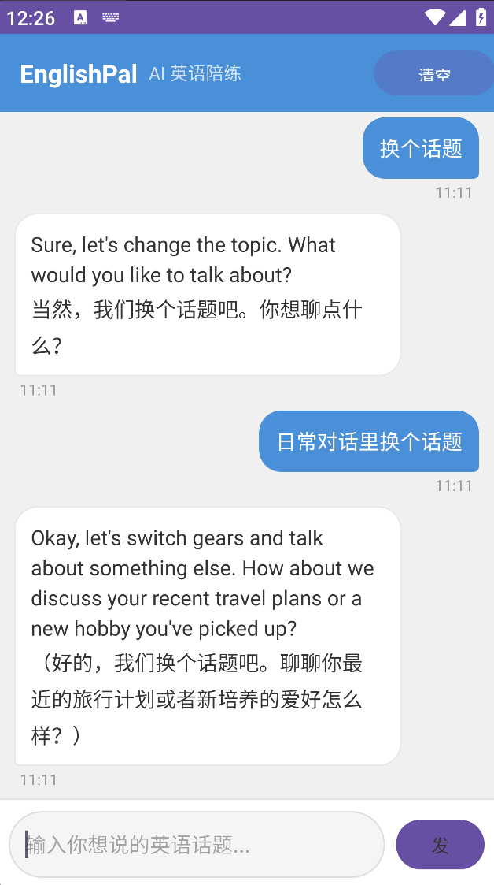
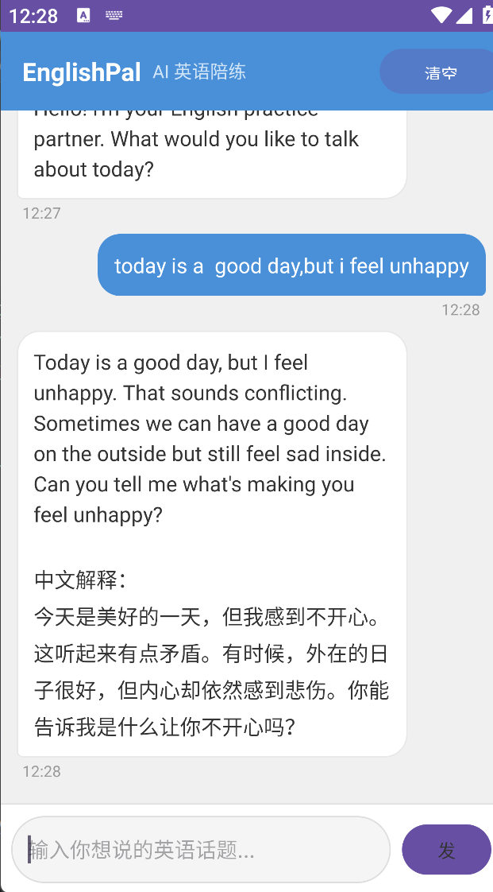

# EnglishPal

Android AI 英语陪练 App，基于 DeepSeek API + SSE 流式输出。

<p float="left">
  
  
</p>

## 功能

- AI 英语对话陪练（英文回复 + 中文解释）
- SSE 流式输出（逐字显示 AI 回复）
- 聊天记录持久化（Room 数据库，重启不丢）
- 消息时间戳 & 长按复制
- Web 版支持 iPhone 通过热点访问

## 技术栈

- **Kotlin** — 主语言
- **OkHttp SSE** — 流式 API 调用
- **Coroutines + StateFlow** — 异步 & 响应式 UI
- **RecyclerView** — 聊天消息列表
- **ViewModel** — UI 状态管理
- **Room** — 本地数据库
- **DeepSeek API** — AI 模型后端

## 配置

1. 用 Android Studio 打开项目
2. 在 `local.properties` 中填入你的 DeepSeek API Key：
   ```
   DEEPSEEK_API_KEY=你的key
   ```
3. 编译运行（最低 SDK 26）
